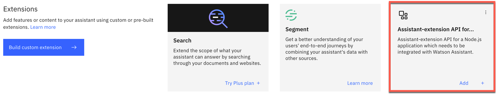
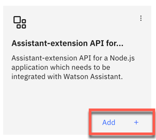
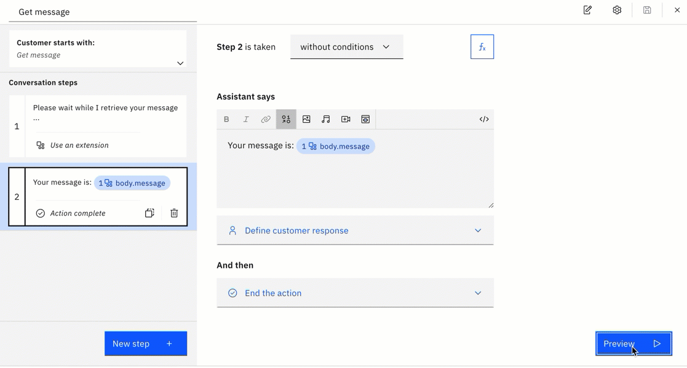

# The setup the extension integration to `Watson Assistant`

With the IBM Cloud `lite plan` instance of a `Watson Assistant service`, you are allowed to [use one `custom extension`].

### 1. Add the extension to integrations of the current assistant

#### Step 1: Open your `assistant`

#### Step 2: Select `integrations`

#### Step 3: On the `integrations` page find `Extensions` and press the button `Build custom extension`

#### Step 4: The `Custom extension` wizard appears and guides you to following tasks

  * Basic information

    * Extension name: `Assistant-extension API for a Node.js application`
    * Description: `Assistant-extension API for a Node.js application which needs to be integrated with Watson Assistant.`

  * Import your OpenAPI document

    * Use following file: `code/node-js-extension/assistant-extension.json`
  
  * Review extension The image below an example of the OpenAPI

    

#### Step 5: Press `Finish`

#### Step 6: Verify the extension available in the catalog 

Now is the extension available in the catalog as you can see in the image below:

  

### 2. Add the extension to the environments of the assistant

#### Step 1: Select `integrations`

#### Step 2: On the `integrations` page find `Extensions`

#### Step 3: Select in the `Extensions` select the newly created `Assistant-extension API for a Node.js application` in your catalog and press `Add`.

   

#### Step 4: Confirme to `Add`

   

#### Step 5: A wiszard appears and guides you to following tasks

  * Configure authentication

    

  * Review operations

    

  * Press `Save` and the press `Close`

#### Step 6: Select the `Environments`

#### Step 7: In the `Environments` you can notice that the `Assistant-extension API for a Node.js application` is available in the `Draft` and `Live` environments

### 3. Use the `Assistant-extension API for a Node.js application` in an action

#### Step 1: Create a new action call `Get message`

#### Step 2: Create the `Step 1` without a condition

#### Step 3: Insert following text into `Assistant says` editor

   ```
   Please wait while I retrieve your message ...
   ```
#### Step 4: Select in `And then ...` the `Use an extension` option. _Now we can use the response values from our extension._

#### Step 5: Create the `Step 2` without a condition

#### Step 6: Insert following text into `Assistant says` editor

   ```
   Your message is: $body.message
   ```
   

#### Step 7:  Select in `And then ...` the `End the action` option

#### Step 8:  Test the `action`

> Note: Ensure that the application in code engine is up and running and not scaled to zero. Visit your [Code Engine project](https://cloud.ibm.com/codeengine/projects).



### 5. Links to useful resources

1. [IBM Cloud documentation for Watson Assistant to build an extension](https://cloud.ibm.com/docs/watson-assistant?topic=watson-assistant-build-custom-extension##build-custom-extension-openapi-file)
2. [IBM Cloud documentation for Watson Assistant to add an extension to an evironment](https://cloud.ibm.com/docs/watson-assistant?topic=watson-assistant-add-custom-extension)
3. [IBM Cloud documentation for Watson Assistant calling an extension from an action](https://cloud.ibm.com/docs/watson-assistant?topic=watson-assistant-call-extension)

